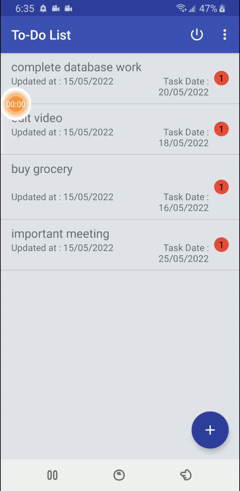
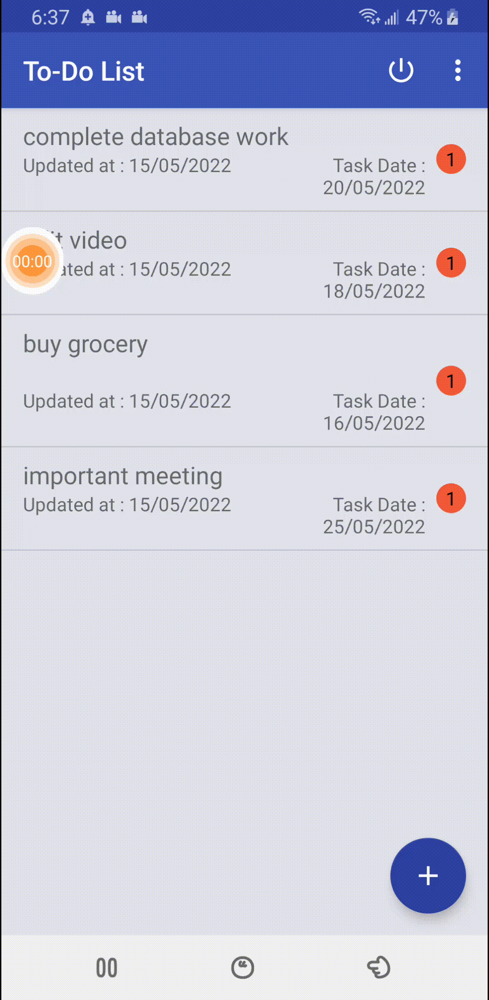
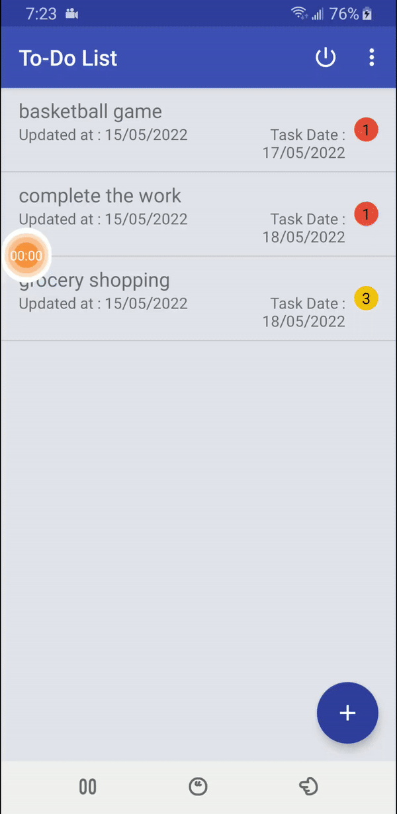

# Todo-App
## About the Installation of the Todo App
#### *** 1 Register and Sign Up:***
Fill up the information and Sign Up into the application.
#### *** 2 Login:***
To login, fill up the credentials with the registered email and password.
##### ***3 Todo List:***
Click on the "+" button on the bottom right to add a list.
#### ***4 Todo Item:*** 
After selecting, fill up the information for you to-do
#### ***5 Editing the Todo Items:***
Click on the Todo Item to update and edit.
#### ***6 Deleting the todo items and Undo if you mistakenly deleted it ***.
You can swipe to delete the todo-list items and undo pops up in bottom to undo the deleted item.
#### ***7 Deleting all List item***.
To delete all the items, delete all button is found at options in top right corner.
#### ***8 Logout Button***.
You can logout using the Logout button.
All the inforamtion will be saved on the account.

#### ***1 Register and Sign Up: : Fill the Required Information and Sign Up.
#### ***2 Login:*** : After Signing Up Login with the same credentials.
##### ***3 Todo List:*** : Click on the floating Add icon and create the Todo List
#### ***4 Todo Item:*** : After creating a Todo List ,Now click on the list and create your Todo Items.
#### ***5 Editing the Todo Items:*** : Click on the Todo Item and edit it.
#### ***6 Deleting the todo items and Undo if you mistakenly deleted it ***: You can delete Todolist or a todoItem.
#### ***7 Deleting all List item***. : You can delete all the tasks by this features.
#### ***8 Logout Button***: You can Logout and save your task in your account.

---

### Design Architecture 
# MODEL
* `adapter`  consists of recyclerviews adapters. 
-`SwipeLeftDelete` 
-`TodoListCallbacks` 
* `Database` consists of dao(class for room database) ,UserAuthentication,db.. 
-`DataAccessObject` 
-`AppDatabase` 
-`Dateconvert` 
-`RegisterUserAuthentication` 
-`TodoLists` 

# `VIEW`
* `Data`  consists of all the datas i.e notification, session, task, user 
-`Screens` consists all the screens i.e addeditTask, login, menu, splash, tasks  

# `ViewModel`
* `LoginRegisterViewModel`   
* `LogoutViewModel`  
* `AddEditTaskViewModel`  
* `SplashViewModel`  
* `DeleteAllTasksViewModel`  
* `MainActivityViewModel`  

## Features
Log-In                  |  Register                    | Adding Task             |  Adding Task by using Speech to text
:----------------------------:|:--------------------------------------:|:----------------------:|:-----------------
 |||
 #
  
Undo         |  Deleting all tasks                 | Options bar|      Alert 
:----------------------------:|:--------------------------------------:|:----------------------:|:-----------------
  |           |    | 
 ---

----------------------------

## Documentation (About Model–view–viewmodel architecture ) 
Model–view–viewmodel (MVVM) is a software architectural pattern that facilitates the separation of the development of the graphical user interface (the view) be it via a markup language or GUI code from the development of the business logic or back-end logic (the model) so that the view is not dependent on any specific model platform. The view model of MVVM is a value converter,meaning the view model is responsible for exposing (converting) the data objects from the model in such a way that objects are easily managed and presented. In this respect, the view model is more model than view, and handles most if not all of the view's display logic.The view model may implement a mediator pattern, organizing access to the back-end logic around the set of use cases supported by the view.
#

---

